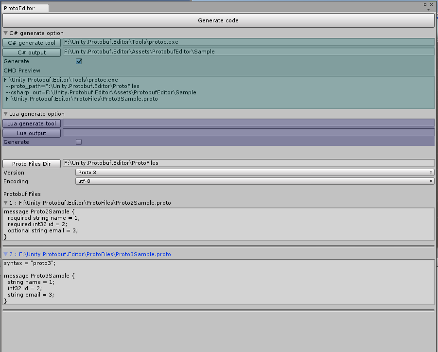

# Unity.Protobuf.Editor 

[简体中文](./README_ZH-cn.md)

Unity3d Google Protobuf C# & lua generator


## Note
* `Lua` generator not support `Proto3`
* `C#` generator generate `Proto3` with `protoc.exe` and `Proto2` with `ProtoGen.exe` 

```csharp
        var sample = new Proto3Sample() { 
            Id = 1, 
            Email = "sample@hotmail.com", 
            Name = "Alvin" 
        };

        // Serialize to bytes
        var bytes = sample.ToByteArray();

        // Serialize to stream
        var stream = new MemoryStream();
        sample.WriteTo(stream);

        //Deserialize from bytes
        sample = Proto3Sample.Parser.ParseFrom(bytes);

        //Deserialize from json string
        sample = Proto3Sample.Parser.ParseJson("");
```

